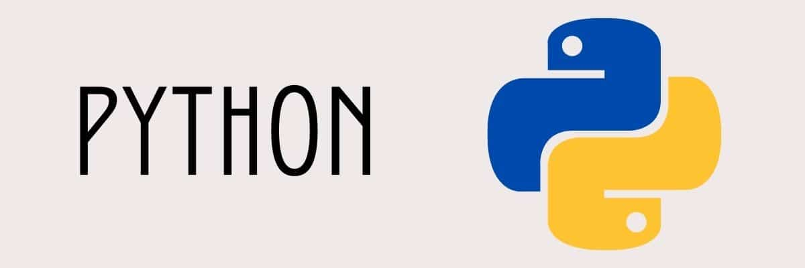

<h1 align="center">
  
</h1>

 • <a href="#--sobre">Sobre</a> • 
  <a href="#--tecnologia-utilizada">Tecnologias utilizadas</a> •

<h2 align="center">
  
</h2>

## :page_facing_up: Sobre

Este projeto contém anotações de aula e exercícios resolvidos do curso de python do canal [Curso em Vídeo](https://www.cursoemvideo.com/) 

## 💻 Tecnologia utilizada

• [Python3](https://www.python.org/)

## 📝 Licença

Esse projeto está sob a licença MIT. 

Veja o arquivo [LICENSE](https://github.com/gabjohann/python_3/blob/main/LICENSE)) para mais detalhes.
